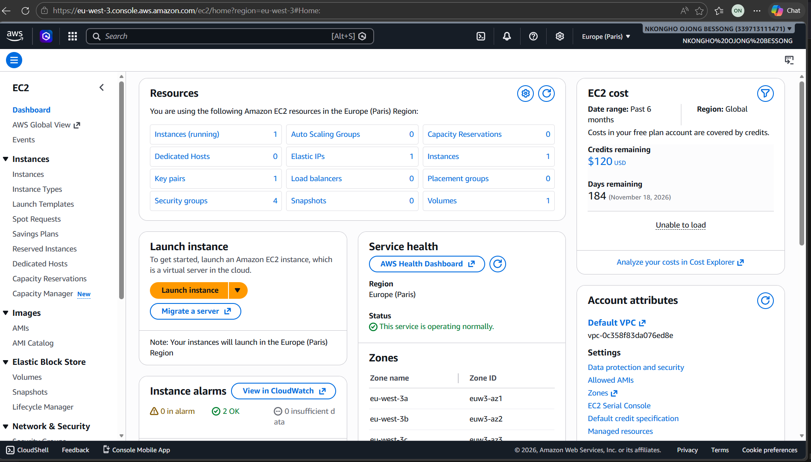
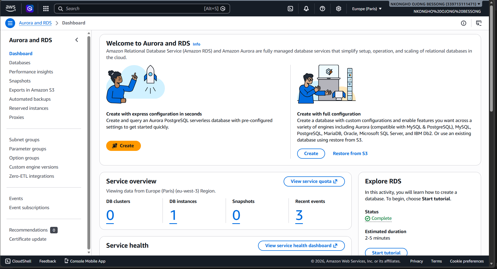
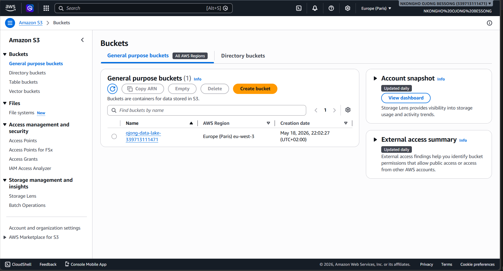
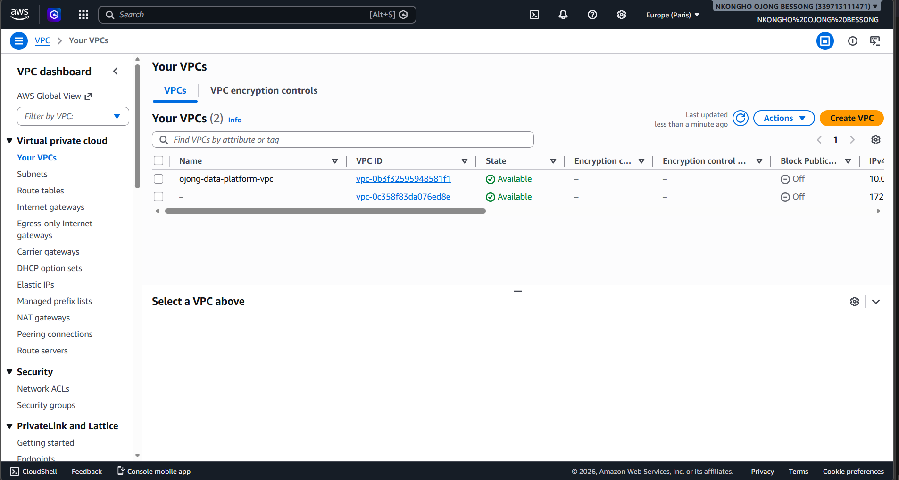
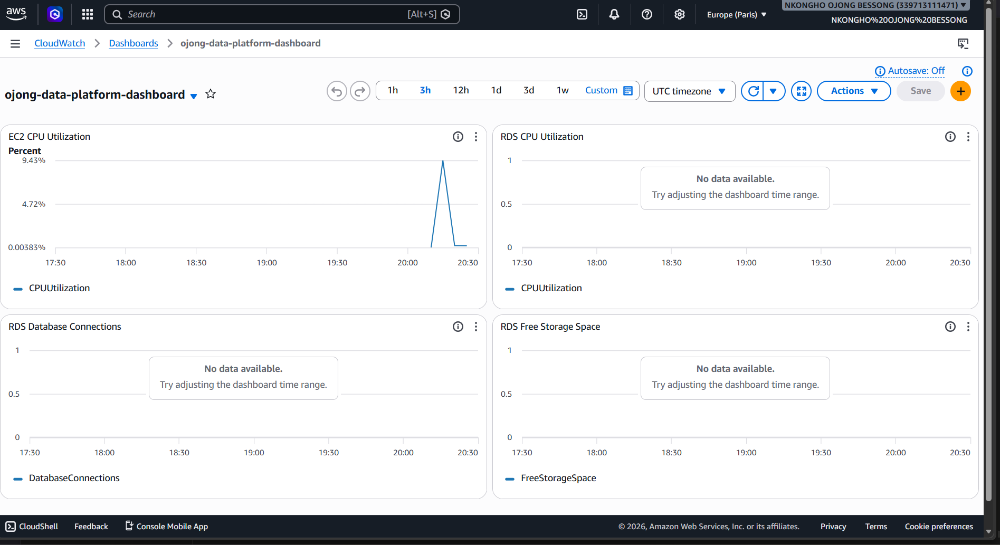
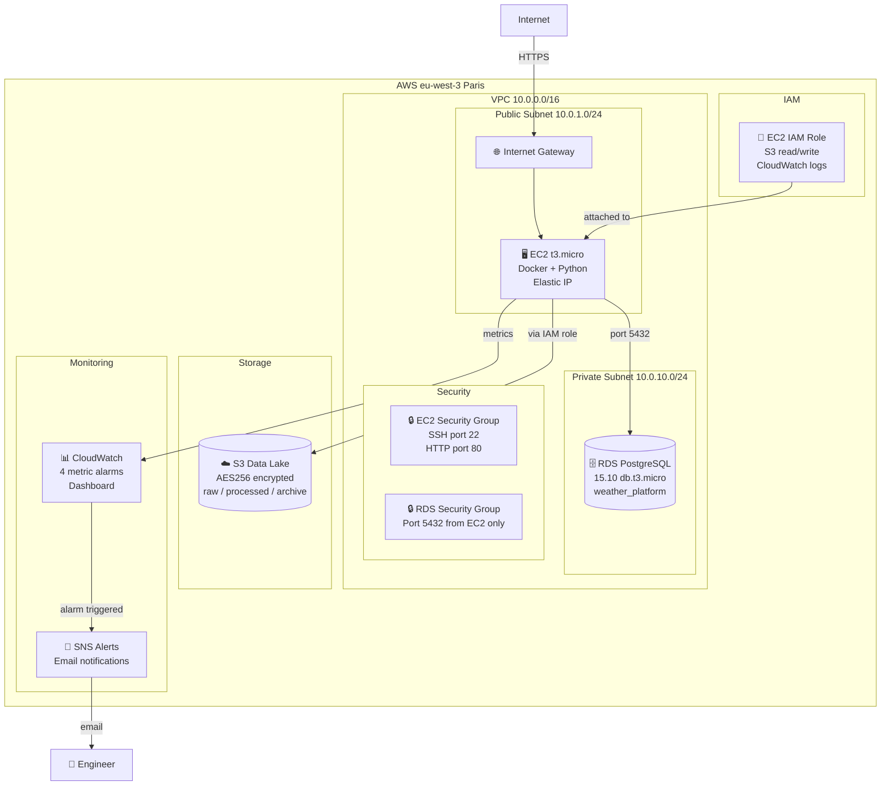

# ☁️ AWS Data Platform — Infrastructure as Code with Terraform


A production-grade cloud data platform provisioned entirely with Terraform on AWS eu-west-3 (Paris). A single `terraform apply` command deploys **41 AWS resources** across 5 modules: networking, compute, storage, database and monitoring — fully reproducible, version-controlled and destroyable with a single command.

This is the third project in my Data Engineering portfolio. Projects 1 and 2 built real pipelines running locally in Docker. This project provisions the cloud infrastructure those pipelines would run on in production.

## 📸 Live Infrastructure Screenshots

> All screenshots taken from the live AWS console after `terraform apply`

**EC2 Instance — Running in eu-west-3a (Paris)**


**RDS PostgreSQL — 1 DB Instance provisioned**


**S3 Data Lake — Created May 18, 2026**


**VPC — ojong-data-platform-vpc available**


**CloudWatch Dashboard — Real EC2 metrics**



---

## ⚡ What Gets Deployed

```
terraform apply  →  41 resources created in ~5 minutes
terraform destroy  →  41 resources deleted in ~3 minutes
```

| Layer | What Terraform Creates |
|---|---|
| **Networking** | VPC (10.0.0.0/16), 2 public subnets, 2 private subnets, Internet Gateway, 2 route tables, EC2 security group, RDS security group |
| **Compute** | EC2 t3.micro with Docker + Python pre-installed, Elastic IP, IAM role, 2 IAM policies |
| **Storage** | S3 data lake with AES256 encryption, versioning, lifecycle policies, raw/processed/archive/logs folders |
| **Database** | RDS PostgreSQL 15.10 db.t3.micro in private subnet, subnet group |
| **Monitoring** | CloudWatch dashboard, 4 metric alarms, SNS topic, email subscription, 2 log groups |

---

## 🏗️ Architecture



### Data Flow

1. **EC2 instance** runs the data pipeline — Docker and Python pre-installed via user_data script on first boot
2. **Pipeline reads/writes** to S3 data lake via IAM role — no credentials stored on the server
3. **Pipeline connects** to RDS PostgreSQL in the private subnet — database never exposed to internet
4. **CloudWatch** collects EC2 and RDS metrics every 5 minutes — dashboard shows CPU, connections and storage
5. **SNS sends email alerts** when CPU exceeds 80%, storage drops below 5GB or instance fails health check

## 📁 Project Structure

```
aws-data-platform/
│
├── modules/
│   ├── networking/           # VPC, subnets, IGW, route tables, security groups
│   │   ├── main.tf           # 12 resources
│   │   ├── variables.tf
│   │   └── outputs.tf
│   ├── compute/              # EC2, Elastic IP, IAM role and policies
│   │   ├── main.tf           # 6 resources + data source for latest AMI
│   │   ├── variables.tf
│   │   └── outputs.tf
│   ├── database/             # RDS PostgreSQL 15.10, subnet group
│   │   ├── main.tf           # 2 resources
│   │   ├── variables.tf
│   │   └── outputs.tf
│   ├── storage/              # S3 data lake, versioning, encryption, lifecycle
│   │   ├── main.tf           # 8 resources
│   │   ├── variables.tf
│   │   └── outputs.tf
│   └── monitoring/           # CloudWatch dashboard, alarms, SNS, log groups
│       ├── main.tf           # 9 resources
│       ├── variables.tf
│       └── outputs.tf
│
├── main.tf                   # Root module — provider config and module wiring
├── variables.tf              # All input variable definitions
├── outputs.tf                # 11 output values shown after apply
├── terraform.tfvars          # Your values — never committed (.gitignore)
├── .gitignore                # Excludes state files, tfvars, .terraform/
└── README.md
```

---

## 🔒 Security Design

**Network isolation:**
- RDS lives in private subnets with no internet route — only EC2 can reach it on port 5432
- Security group rules are explicit — no wildcard database access
- Public subnets only contain EC2 — not the database

**IAM least privilege:**
- EC2 has a scoped IAM role — only S3 read/write on the specific bucket and CloudWatch logs
- No access keys stored on the server — AWS handles authentication through the instance profile
- Root user access keys are used only for provisioning — should be rotated after deployment

**Data encryption:**
- S3 bucket uses AES256 server-side encryption — all objects encrypted at rest
- RDS storage is encrypted — `storage_encrypted = true`
- S3 bucket has public access fully blocked — no accidental exposure

---

## 💰 Cost Awareness

All resources use free tier eligible instance types:

| Resource | Type | Free Tier | Monthly Cost After Free Tier |
|---|---|---|---|
| EC2 | t3.micro | 750 hrs/month | ~$8.50 |
| RDS | db.t3.micro | 750 hrs/month | ~$16.00 |
| S3 | Standard | 5GB | ~$0.023/GB |
| Elastic IP | — | Free when attached | $0.005/hr when unattached |
| CloudWatch | Basic | 10 metrics free | ~$0.30/metric |

**This project uses $100 AWS credits — no real charges during development.**

**Always run `terraform destroy` after testing to avoid unnecessary charges.**

---

## 🚀 How to Deploy

### Prerequisites

- [Terraform](https://developer.hashicorp.com/terraform/install) >= 1.0
- [AWS CLI v2](https://aws.amazon.com/cli/) configured
- AWS account with sufficient permissions

### Step by step

**1. Clone and enter the repository**

```bash
git clone https://github.com/OjongBessongNKONGHO/aws-data-platform.git
cd aws-data-platform
```

**2. Configure AWS credentials**

```bash
aws configure
# AWS Access Key ID: YOUR_KEY
# AWS Secret Access Key: YOUR_SECRET
# Default region: eu-west-3
# Default output format: json
```

**3. Create SSH key pair**

```bash
# Linux/Mac
aws ec2 create-key-pair --key-name ojong-data-platform-key \
  --query 'KeyMaterial' --output text > ~/.ssh/ojong-data-platform-key.pem
chmod 400 ~/.ssh/ojong-data-platform-key.pem

# Windows PowerShell
aws ec2 create-key-pair --key-name ojong-data-platform-key `
  --query 'KeyMaterial' --output text | `
  Out-File -FilePath "$HOME\.ssh\ojong-data-platform-key.pem" -Encoding ascii
```

**4. Create terraform.tfvars**

```hcl
project_name      = "ojong-data-platform"
environment       = "dev"
aws_region        = "eu-west-3"
bucket_name       = "ojong-data-lake-YOUR-ACCOUNT-ID"
key_pair_name     = "ojong-data-platform-key"
db_password       = "YourSecurePassword2026"
alarm_email       = "your-email@example.com"
ec2_instance_type = "t3.micro"
db_instance_class = "db.t3.micro"
```

**5. Initialize, plan and apply**

```bash
terraform init    # Download AWS provider
terraform plan    # Preview 41 resources — no changes made
terraform apply   # Deploy everything (~5 minutes)
```

**6. Connect to your EC2 instance**

```bash
ssh -i ~/.ssh/ojong-data-platform-key.pem ec2-user@YOUR_EC2_PUBLIC_IP
```

**7. Destroy everything when done**

```bash
terraform destroy  # Removes all 41 resources — stops all charges
```

---

## 📊 Real Outputs After Apply

```hcl
ami_used                 = "ami-036c17897b0b12816"
cloudwatch_dashboard_url = "https://eu-west-3.console.aws.amazon.com/cloudwatch/home?region=eu-west-3#dashboards:name=ojong-data-platform-dashboard"
ec2_public_dns           = "ec2-35-181-130-129.eu-west-3.compute.amazonaws.com"
ec2_public_ip            = "35.181.130.129"
ec2_ssh_command          = "ssh -i ~/.ssh/ojong-data-platform-key.pem ec2-user@35.181.130.129"
pipeline_log_group       = "/ojong-data-platform/pipeline"
rds_endpoint             = "ojong-data-platform-postgres.clyck024gx9u.eu-west-3.rds.amazonaws.com:5432"
rds_port                 = 5432
s3_bucket_arn            = "arn:aws:s3:::ojong-data-lake-339713111471"
s3_bucket_name           = "ojong-data-lake-339713111471"
vpc_id                   = "vpc-0b3f32595948581f1"
```

---

## 🧠 Key Engineering Decisions

**Why modular Terraform instead of a single file?**
Each module is an independent, reusable unit. The networking module can be used by other projects. The monitoring module can be updated without touching compute. This is how real infrastructure teams structure Terraform at scale — not one 1000-line main.tf file.

**Why private subnets for RDS?**
The database has no route to the internet and no public IP. The RDS security group only allows inbound connections from the EC2 security group on port 5432. Even if an attacker reached the internet gateway, they cannot reach the database. This is the correct production security posture.

**Why an Elastic IP for EC2?**
Without an Elastic IP, the EC2 public IP changes every time the instance stops and starts. An Elastic IP provides a fixed address so SSH commands, DNS records and any dependent services remain stable across restarts.

**Why IAM role instead of access keys on EC2?**
Access keys stored on servers are a critical security risk. The EC2 instance accesses S3 and CloudWatch through an IAM instance profile — AWS injects temporary rotating credentials automatically. No credentials are ever stored on the server.

**Why S3 lifecycle policies?**
Raw data moves to Infrequent Access after 30 days and Glacier after 60 days automatically, reducing storage costs as data ages without any manual intervention. This is how data lakes manage cost at petabyte scale — the same principle applies even at small scale.

**Why `terraform destroy`?**
Infrastructure as Code means the entire environment can be recreated from scratch at any time. Destroying and recreating is safer and cheaper than leaving resources running. This is also how staging environments work in production — spin up for testing, destroy after.

---

## 🔗 Portfolio Context

This project is the cloud infrastructure layer for my data engineering portfolio:

| Project | What it does | Stack |
|---|---|---|
| [Weather ETL Pipeline](https://github.com/OjongBessongNKONGHO/weather-etl-pipeline) | Batch ETL — hourly weather data pipeline | Airflow, PostgreSQL, Docker |
| [Kafka Streaming Pipeline](https://github.com/OjongBessongNKONGHO/kafka-streaming-pipeline) | Real-time streaming — Kafka producer/consumer | Kafka, Pydantic v2, PostgreSQL, Docker |
| **AWS Data Platform** (this repo) | Cloud infrastructure for the above pipelines | Terraform, AWS, IaC |

The EC2 instance in this project runs Docker and Python — ready to host the ETL and Kafka pipelines. The RDS PostgreSQL instance replaces the local Docker PostgreSQL used in Projects 1 and 2. The S3 data lake provides persistent storage for raw and processed weather data.

---

## 👤 Author

**Ojong Bessong NKONGHO**
Data Engineering Student — DSTI School of Engineering, Paris
Seeking Data Engineering internship (July 2026) & apprenticeship (September 2026)

[](https://linkedin.com/in/nkongho-ojong)
[](https://github.com/OjongBessongNKONGHO)